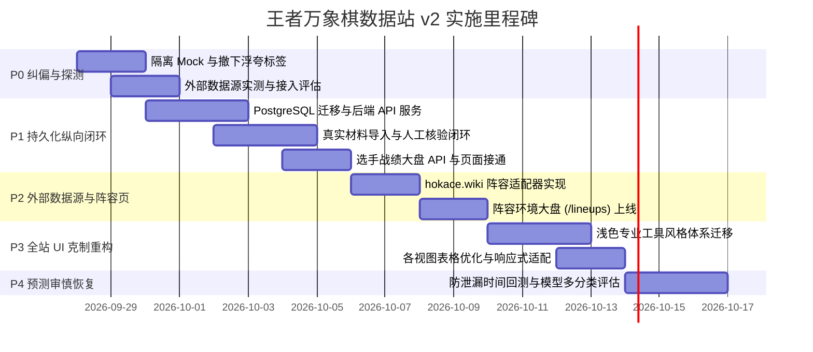

# 王者万象棋数据站 v2 落地开发实施计划书

> 关联任务书：[王者万象棋数据站_真实数据接入与UI改版开发任务书_v2.md](./王者万象棋数据站_真实数据接入与UI改版开发任务书_v2.md)  
> 制定日期：2026-09-27  
> 责任团队：全栈研发 / 数据工程 / QA 验收  
> 实施原则：**拒绝假数据、拒绝伪识别、可复算追溯、克制数据工具**

---

## 一、 总体目标与交付里程碑

将项目由**前端静态演示原型**推进为具备**真实持久化后端、外部阵容适配器、可追溯逐局战绩、克制专业报表 UI**的生产级数据产品。

---

## 二、 阶段拆解与工作分解结构 (WBS)

### 阶段 P0：真实性纠偏与来源探测（Day 1 ~ Day 2）

#### 目标
清除“假真实”隐患，建立真实与演示数据的物理隔离，完成外部候选源的正式探测。

#### 任务清单
1. **代码与数据清理**：
   - 移除 `image-analyzer.ts` 和 `analyzer.mjs` 中“根据文件大小/哈希猜选手”的伪识别逻辑；未识别时返回明确的 `UNRECOGNIZED` 错误，引导人工录入；
   - 隔离 `frontend/src/mock/` 目录，禁止生产代码直接 import，仅在 `DEMO_MODE=true` 或单元测试 Fixtures 中加载；
   - 移除界面中的夸张文案（“绝对正期望”、“秒级决策雷达”、“独家红利”等），修正进度条为“相对最高热度”解释；
   - 撤销无凭证支撑的“硬门槛 B 已核验”徽标。
2. **外部数据源技术探测**：
   - **hokace.wiki**：实测页面结构与 API 暴露情况，记录版本快照、字段规范及请求频控限制；
   - **TapTap 战绩小助手 / 微信小程序**：记录绑定机制，明确声明不支持未授权批量抓取；配置 `OFFICIAL_API` 适配器为 `UNAVAILABLE`；
   - 产出《数据源接入合规与技术报告》。

---

### 阶段 P1：持久化纵向闭环与核验入库（Day 3 ~ Day 6）

#### 目标
建立 Node.js (TypeScript) + PostgreSQL 真实后端服务，打通“导入 → 校对 → 落库 → 统计查询 → 前端展示”全链路。

#### 任务清单
1. **数据库初始化与版本化迁移**：
   - 在 PostgreSQL 17 中执行 `database/` 下的表结构升级，补全 `data_source`、`ingestion_run`、`raw_record`、`evidence`、`player`、`event`、`participant`、`record_revision` 表；
   - 严格增加 `match_time`, `observed_at`, `ingested_at`, `verified_at`, `available_at` 字段，建立复合唯一键防止重复建局。
2. **后端业务服务搭建 (`backend/`)**：
   - 技术选型：Node.js 22 + Fastify/Express + TypeScript + `pg` 连接池；
   - 实现任务书第 8 节定义的 11 个核心 RESTful API；
   - 实现无偏聚合统计函数：登顶率、前三率、平均名次严格按有效对局数 N 实时计算（N=0 返回 null，N<20 标记样本不足）；
   - 提供 SSE 更新通知服务（通知数据版本变更，客户端按版本主动拉取）。
3. **真实导入与核验流**：
   - 真实截图上传：保存原始图片文件与 SHA-256 哈希；
   - 截图候选结构化解析：接入 OCR 或人工录入，提供原图与候选并排校对工作台；
   - 提供 CSV/JSON 批量战绩导入与字段行级校验；
   - 确认入库后方可进入正式统计库，保留审核日志与修订历史。
4. **前端选手与战绩页接通**：
   - `frontend/src/views/player-roster.vue` 接入 `/api/v1/players`；
   - `frontend/src/views/match-archive.vue` 接入 `/api/v1/events`；
   - 实现真实空态、加载态与错误提示，支持基于 URL 的分页与多维度排序。

---

### 阶段 P2：外部数据源适配与阵容环境大盘（Day 7 ~ Day 9）

#### 目标
完成至少一个外部可用源的接入，上线独立的阵容环境大盘 `/lineups`。

#### 任务清单
1. **外部阵容适配器 (`backend/src/adapters/hokace.ts`)**：
   - 实现定时与手动触发同步任务，抓取外部公开快照；
   - 严格记录 `source_id`、`version`、`window_start/end`、`data_as_of`，保留原始 HTML/JSON 存证；
   - 幂等入库，支持失败重试与超时保护；若外部源无更新则不造数据。
2. **新增阵容大盘视图 (`frontend/src/views/lineup-roster.vue`)**：
   - 路由：`/lineups` 与 `/lineups/:id`；
   - 展示核心英雄、核心棋手、样本量、登顶率、前三率、平均名次与数据来源；
   - 标注“外部第三方聚合数据”，不与本站选手逐局战绩混合混排；
   - 提供不同数据版本与窗口的独立筛选。

---

### 阶段 P3：全站 UI 风格克制重构（Day 10 ~ Day 12）

#### 目标
彻底摆脱高饱和霓虹与游戏营销感，重构为专业、克制、清晰的数据工具。

#### 任务清单
1. **设计系统全面翻新 (`frontend/src/styles/`)**：
   - 统一采用浅色数据板设计：背景 `#F6F7F9`、主卡片 `#FFFFFF`、正文 `#1F2937`、辅助字 `#667085`、边框 `#E4E7EC`、主强调色 `#2563EB`；
   - 移除背景发光、渐变字、玻璃态虚化；
   - 统一使用等宽数字字体展示胜率、名次与样本数，数值右对齐。
2. **主导航与视图层级调整**：
   - 调整主导航：**今日对决 (`/`)** | **选手大盘 (`/roster`)** | **阵容环境 (`/lineups`)** | **历史归档 (`/archive`)**；
   - 证据链审核与数据源同步移入二级管理区；
   - 优化 375px、768px、1280px 全断点响应式，宽表格容器横向自适应滚动，杜绝全屏横向溢出。

---

### 阶段 P4：预测审慎恢复与滚动回测（独立阶段）

#### 目标
在真实数据样本积累充足的前提下，通过严格的时序回测后再行开放决策模块。

#### 任务清单
1. **时序安全基准校验**：
   - 强制执行特征截点检查：赛前特征只能使用 `match_time < cutoff` 且 `available_at <= cutoff` 的已确认数据。
2. **多分类评估模型**：
   - 实现 6 人多分类 Brier 分数：$\text{Brier} = \frac{1}{M}\sum \sum (p_{ij} - y_{ij})^2$；
   - 计算对数损失 Log Loss 并对比 $1/6$ 均匀基线；
   - 仅当模型在多时间窗口滚动的 Brier 稳定优于基线时，方可解禁赛前辅助决策功能。

---

## 三、 责任分工与代码落点清单

| 模块 | 涉及文件 | 责任与交付要求 |
| :--- | :--- | :--- |
| **数据库** | `database/schema.sql`, `views.sql`, `migrations/` | PostgreSQL 17 生产表结构与迁移脚本，含时间审计与防泄漏约束 |
| **业务后端** | `backend/src/server.ts`, `backend/src/routes/` | RESTful API、聚合统计引擎、SSE 事件流、导入校验器 |
| **外部适配器** | `backend/src/adapters/hokace.ts` | 第三方快照采集与幂等写入，记录运行状态与错误日志 |
| **前端状态层** | `frontend/src/stores/`, `frontend/src/api/` | 移除 mock 直连，增加加载/错误/空态状态机与数据源元信息 |
| **前端视图层** | `frontend/src/views/`, `frontend/src/components/` | UI 全面转为浅色克制数据风，新增 `/lineups` 页面，调整路由 |
| **自动化测试** | `frontend/tests/`, `backend/tests/` | 覆盖 A01~A17 验收用例，持续集成通过 |

---

## 四、 阶段验收标准 (A01 ~ A17 对应矩阵)

| 阶段 | 必须通过的验收用例 | 交付物与检验方式 |
| :--- | :--- | :--- |
| **P0** | **A01** (空库真实态), **A11** (无伪识别), **A12** (进度条语义) | 演示模式开关有效；上传不同图片不返回固定伪名单；无虚假文案 |
| **P1** | **A02** (重启持久化), **A03** (导入幂等), **A06** (统计复算), **A07** (零样本 null) | 重启后端数据不丢；重复导入不翻倍；手算 N=6 登顶率与均名完全吻合 |
| **P2** | **A04** (外部源核对), **A05** (持续同步), **A10** (范围隔离) | 至少 1 个外部源同步成功并保留原始快照；阵容统计与选手战绩清晰隔离 |
| **P3** | **A15** (真实分页筛选), **A16** (375/768/1280 响应式与克制样式) | 无横向溢出；无炫光与夸张推演；空态/错误态完备 |
| **P4** | **A09** (双截点防泄漏), **A18** (完整多分类 Brier 评分) | 严格时序隔离；滚动回测报告与基线对比证据齐全 |
